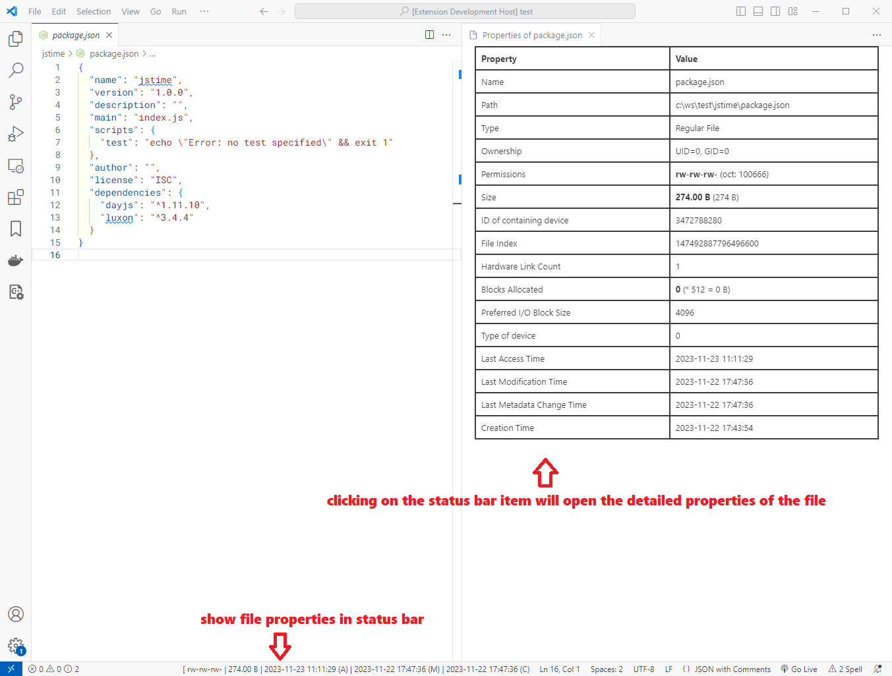

# vsc-file-properties

A VSCode extension for viewing file properties conveniently.

## Features

- Display customized file properties in the status bar.
- Click the status bar item to view the detailed properties of the file.
- Optional size unit standards.
- Optional time formatting.

## Requirements

- VS Code [`1.64.0`](https://code.visualstudio.com/updates/v1_64) or higher

## Extension Settings

- `file-properties.statusBarAlignment`: Status bar alignment, 'left' or 'right'.
- `file-properties.showPermissionsInStatusBar.darwin`: Show file permissions in status bar.
- `file-properties.showPermissionsInStatusBar.linux`: Show file permissions in status bar.
- `file-properties.showPermissionsInStatusBar.win32`: Show file permissions in status bar.
- `file-properties.showSizeInStatusBar`: Show file size in status bar.
- `file-properties.showATimeInStatusBar`: Show the last access time of file in status bar.
- `file-properties.showMTimeInStatusBar`: Show the last modification time of file in status bar.
- `file-properties.showCTimeInStatusBar`: Show the last metadata change time of file in status bar.
- `file-properties.sizeUnit`: Unit for file size. 'si' (International System of Units, 1KB = 1000B) or 'iec' (International Electrotechnical Commission, 1KiB = 1024B).
- `file-properties.timeFormat`: Format of time. See: https://day.js.org/docs/en/parse/string-format.

## Known Issues

Run into a bug? Report it [here](https://github.com/dsyx/vsc-file-properties/issues).

## Release Notes

Detailed release notes are available [here](https://github.com/dsyx/vsc-file-properties/releases).
